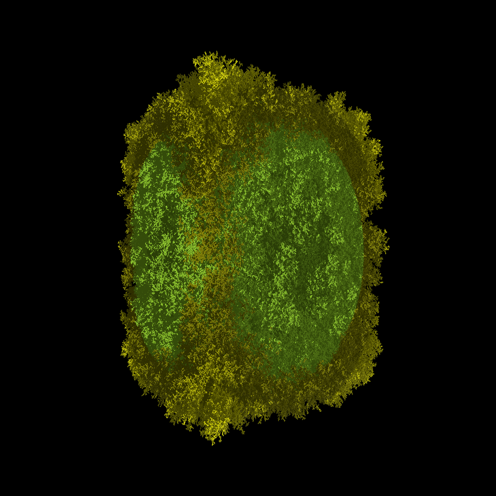

# Diffusion Limited Aggregation system

An implementation of [Diffusion Limited Aggregation systems][dla] that can be
rendered by using povray or can be explored interactively by using a dead simple
viewer.

## Povray

It's possible to save the DLA system as a pov file ready to be rendered with
povray. Here's an example to render 10 millions particles on a 4K canvas.

```shell
$ cargo run --release -- -p 10000000 -a 8 -g 30 -s povray
$ povray +A +W4096 +H4096 dla.pov
```

## Interactive JS viewer

It's also possible to dump the state of the DLA system as a plain JS file that
can be used to power great web visualizations. An example viewer is provided and
here's an example on how to explore a system made of 10K particles.

```shell
$ cargo run --release -- -p 10000 -a 8 -g 30 -s js
$ firefox index.html
```

## Example



[dla]: https://en.wikipedia.org/wiki/Diffusion-limited_aggregation
